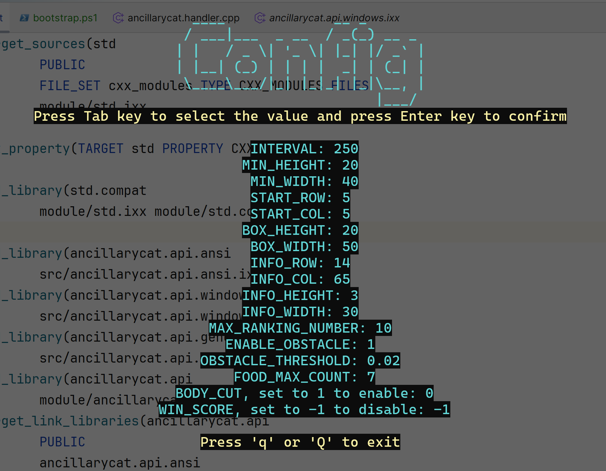
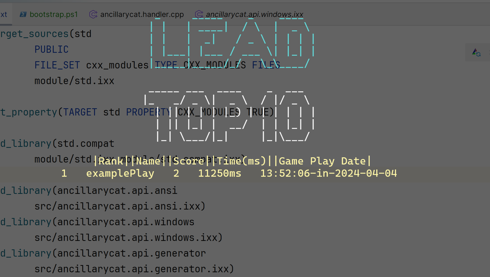
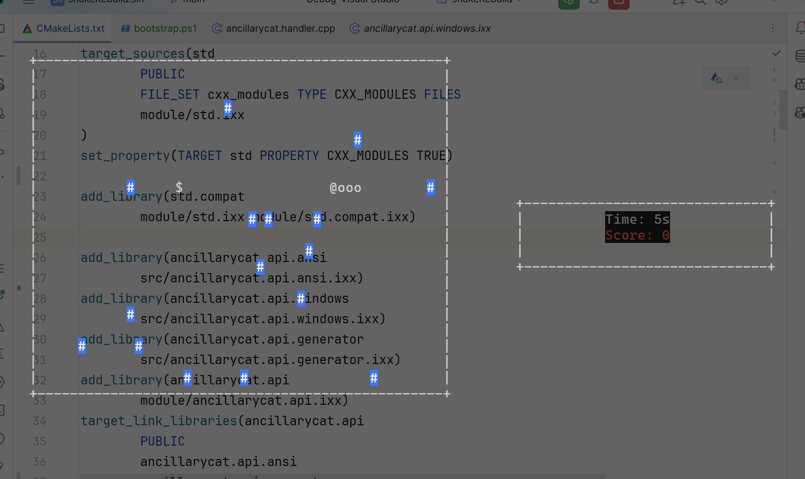

# Snake Game

## Overview

Simple Snake Game, from a C++ newbie.

*This is a homework project so if you are a C++ expert pls do not be so hard on me! :P*

## Build From Source

### Environment

Windows 10+, C++ Standard 23, clang++/cl compiler

### Build with MSBuild (Recommended)

Microsoft Visual Studio minimum version 17.9.0

Open `snakeRebuild.sln` using Visual Studio.

Select `Release`, and then click `Build`.

All done.

### Build With Cmake

*This approach is not recommended due to the insufficient support of Cmake for C++ module.*

Cmake minimum version 3.27, Ninja minimum version 1.11.0

#### First Compiling

Open `Develop PowerShell for VS (x64)` , navigate to the folder and type:

```powershell
mkdir build && cd build
cmake -DCMAKE_BUILD_TYPE=Release -DCMAKE_MAKE_PROGRAM=ninja -G Ninja -DCMAKE_SYSTEM_NAME=WindowsStore -S .. -B .
cd ..
```

*__Due to the incomplete support for C++ 20 module, the ninja and Cmake behave weirdly.__*

*__If you have advice of that build automation pls feel free to create a PR!__*

Run `bootstrap.ps1` at least 3 times in VSDev PowerShell:

```powershell
./bootstrap.ps1
./bootstrap.ps1
./bootstrap.ps1
```

If success, the executable would launch after building. If not, you may manually build every static library(see below).

#### Separate Compiling

 If you changed a single module, you may run:

```powershell
cmake --build [build directory] --target [modified library] -j 30
```

And then

```powershell
cmake --build [build directory] --target snakeRebuild -j 30
```

Alternatively you can also run the `./bootstrap.ps1`.

### External Dependencies

None.

## Pictures







### TODOs

Fix multi-threading bug

Add multi-player mode

> Author: LiAuTraver
>
> Hello from Hangzhou.


